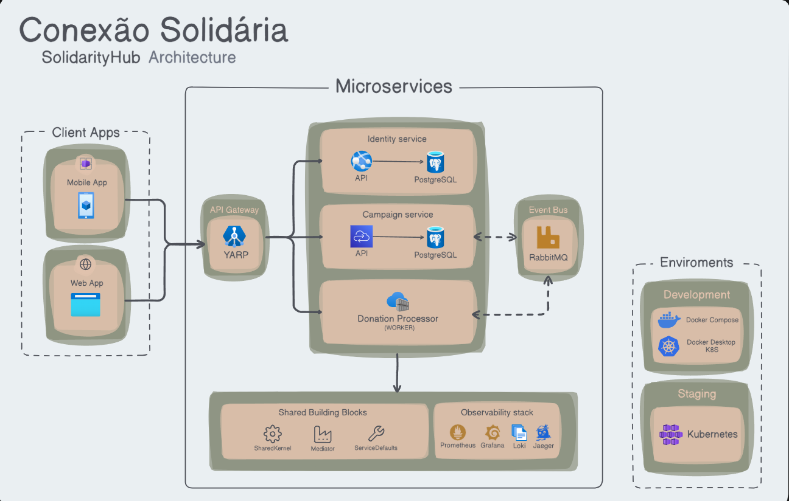

# SolidarityHub


Plataforma distribuida para gestao de identidade, campanhas solidarias e processamento assincrono de doacoes, com foco em microsservicos, observabilidade e execucao local via Docker e Kubernetes.

## Visao geral

O SolidarityHub foi estruturado como uma solucao orientada a dominios separados, com gateway de entrada, APIs independentes, worker assincrono e blocos compartilhados reutilizaveis. O objetivo da arquitetura e suportar:

- autenticacao via JWT;
- autorizacao baseada em papeis;
- gestao de campanhas com regras de negocio;
- registro de intencoes de doacao;
- processamento assincrono de eventos via broker;
- monitoramento por metricas, logs e tracing;
- execucao local simples para desenvolvimento e validacao.

## Arquitetura



## Componentes da solucao

### API Gateway

O gateway centraliza o acesso externo e faz o roteamento para os microsservicos internos.

Responsabilidades principais:

- ponto unico de entrada;
- autenticacao e autorizacao;
- health checks;
- rate limiting;
- documentacao agregada em modo de desenvolvimento;
- roteamento via YARP.

### Microsservicos

#### `identity-api`

Responsavel pelo contexto de identidade:

- cadastro de usuarios;
- autenticacao;
- refresh token;
- alteracao de senha;
- consulta de perfil autenticado.

#### `campaign-api`

Responsavel pelo contexto de campanhas:

- criacao e manutencao de campanhas;
- painel publico;
- recebimento de intencoes de doacao;
- publicacao de eventos para processamento assincrono.

#### `donation-processor`

Worker de background que:

- consome eventos do RabbitMQ;
- processa a doacao assincronamente;
- atualiza o valor arrecadado da campanha.

### Infraestrutura de dados

#### PostgreSQL

A solucao usa dois bancos logicos no PostgreSQL:

- `identity_db`
- `campaign_db`

#### RabbitMQ

Usado como broker para o fluxo assincrono de doacoes entre API e worker.

### Blocos compartilhados

Bibliotecas reutilizadas entre os servicos:

- `shared-kernel`
- `mediator`
- `event-bus`
- `event-bus-rabbitmq`
- `service-defaults`

### Observabilidade

Stack configurada para diagnostico e monitoramento:

- `Prometheus`
- `Grafana`
- `Loki`
- `Jaeger`

## Fluxos tecnicos principais

### Fluxo de autenticacao

1. O cliente chama o gateway.
2. O gateway encaminha para `identity-api`.
3. O usuario autentica e recebe um JWT.
4. O token e usado nas chamadas autenticadas aos endpoints protegidos.

### Fluxo de campanha

1. O cliente autenticado como gestor chama o gateway.
2. O gateway encaminha para `campaign-api`.
3. A API valida as regras de negocio.
4. A campanha e persistida em `campaign_db`.

### Fluxo de doacao assincrona

1. O doador autenticado registra uma intencao de doacao.
2. O `campaign-api` valida a campanha e registra a intencao.
3. O `campaign-api` publica um evento no `RabbitMQ`.
4. O `donation-processor` consome a mensagem.
5. O worker processa a doacao e atualiza o valor arrecadado da campanha.
6. O painel publico passa a refletir o total atualizado.

## Autenticacao e autorizacao

Autenticacao:

- JWT

Papeis tecnicos:

- `NGO_MANAGER`
- `DONOR`

Mapeamento funcional:

- `NGO_MANAGER`: gestor da ONG
- `DONOR`: doador autenticado

Politicas de acesso:

- endpoints de gestao exigem perfil de gestor;
- endpoints de doacao exigem perfil de doador;
- endpoints publicos permanecem anonimos quando aplicavel.

## Endpoints principais

### Autenticacao e usuarios

- `POST /api/auth/register`
- `POST /api/auth/sign-in`
- `POST /api/auth/refresh`
- `PUT /api/auth/change-password`
- `GET /api/auth/validate`
- `GET /api/users/me`

### Campanhas

- `POST /api/campaigns/`
- `PUT /api/campaigns/{id}`
- `PUT /api/campaigns/{id}/complete`
- `PUT /api/campaigns/{id}/cancel`
- `GET /api/campaigns/`
- `GET /api/campaigns/public-panel`
- `GET /api/campaigns/active`

### Intencao de doacao

- `POST /api/donation-intents/{campaignId}`
- `GET /api/donation-intents/{id}`
- `GET /api/donation-intents/donors/{donorId}`
- `GET /api/donation-intents/campaigns/{campaignId}`
- `GET /api/donation-intents/pendings`

## Stack tecnologica

- **Backend**: .NET 10
- **Gateway**: YARP Reverse Proxy
- **Mensageria**: RabbitMQ
- **Banco de dados**: PostgreSQL
- **Observabilidade**: OpenTelemetry, Prometheus, Grafana, Loki, Jaeger
- **Containers**: Docker / Docker Compose
- **Orquestracao**: Kubernetes / AKS
- **Testes**: xUnit
- **CI/CD**: GitHub Actions

## Como rodar localmente com Docker Compose

### Pre-requisitos

- .NET SDK 10
- Docker Desktop
- Docker Compose

### 1. Criar o arquivo de ambiente

PowerShell:

```powershell
Copy-Item .env.example .env
```

### 2. Ajustar configuracoes minimas

No arquivo `.env`, revise pelo menos:

- `POSTGRES_ADMIN_PASSWORD`
- `IDENTITY_DB_PASSWORD`
- `CAMPAIGN_DB_PASSWORD`
- `RABBITMQ_PASSWORD`
- `PGADMIN_DEFAULT_PASSWORD`
- `GRAFANA_ADMIN_PASSWORD`
- `JWT_SECRET`

Para facilitar validacao com um usuario gestor seed:

- `IDENTITY_ADMIN_SEED_ENABLED=true`
- `IDENTITY_ADMIN_SEED_EMAIL=admin@conexaosolidaria.local`
- `IDENTITY_ADMIN_SEED_PASSWORD=<senha forte>`

### 3. Subir toda a solucao

```bash
docker compose up -d --build
```

### 4. Verificar containers

```bash
docker compose ps
```

### 5. Acessos locais

| Recurso | URL |
|---|---|
| Gateway | [http://localhost:5000](http://localhost:5000) |
| Portal de documentacao | [http://localhost:5000/docs](http://localhost:5000/docs) |
| Health do gateway | [http://localhost:5000/health](http://localhost:5000/health) |
| Grafana | [http://localhost:3000](http://localhost:3000) |
| Prometheus | [http://localhost:9090](http://localhost:9090) |
| Jaeger | [http://localhost:16686](http://localhost:16686) |
| PgAdmin | [http://localhost:5050](http://localhost:5050) |

> Observacao: no `docker-compose.yml` atual, a interface de administracao do RabbitMQ nao esta exposta por porta HTTP. Se voce precisar demonstrar o management UI, sera necessario expor a porta correspondente ou usar outra estrategia no ambiente de demonstracao.

### 6. Encerrar o ambiente

```bash
docker compose down
```

## Como rodar os testes

```bash
dotnet test SolidarityHub.slnx --nologo
```

Projetos de teste atuais:

- `Campaign.UnitTests`
- `Identity.UnitTests`

Ultima validacao executada nesta revisao:

- `Campaign.UnitTests`: 72 aprovados
- `Identity.UnitTests`: 131 aprovados

### Cobertura de codigo

Os testes usam **xUnit** com **coverlet** para coleta de cobertura. O escopo medido (assemblies incluidos e arquivos excluidos, como `Program.cs`, migrations e configuracoes de EF) fica em [`tests/coverage.runsettings`](./tests/coverage.runsettings).

Para gerar a cobertura localmente e consolidar os dois projetos em um unico relatorio HTML:

```bash
dotnet tool install --global dotnet-reportgenerator-globaltool

dotnet test SolidarityHub.slnx --settings tests/coverage.runsettings

reportgenerator   "-reports:tests/*/TestResults/*/coverage.cobertura.xml"   "-targetdir:coveragereport"   "-reporttypes:Html;MarkdownSummaryGithub"
```

Abra `coveragereport/index.html` para navegar por assembly, classe e linha.

Cobertura consolidada nesta revisao (7 assemblies):

- linhas: **93,7%** (1586 de 1692)
- branches: **88,1%** (297 de 337)

## Kubernetes

Os manifests da solucao estao em:

- [`platform/k8s`](./platform/k8s)

Documentacao detalhada para execucao local em Kubernetes:

- [`docs/kubernetes-local.md`](./docs/kubernetes-local.md)

O material atual cobre principalmente:

- base Kubernetes;
- overlay `dev`;
- overlay `staging`;
- observabilidade local no cluster.

## Observabilidade

A solucao expoe health checks e metricas e integra a stack de observabilidade para:

- saude dos servicos;
- metricas de aplicacao;
- logs estruturados;
- tracing distribuido.

Ferramentas:

- **Prometheus**: coleta de metricas
- **Grafana**: dashboards
- **Loki**: logs
- **Jaeger**: tracing

## CI/CD

Workflows disponiveis em [`.github/workflows`](./.github/workflows):

- `continuous-integration.yml`
- `continuous-delivery.yml`
- `continuous-deployment.yml`

Resumo:

- **CI**: restore, build, testes unitarios com cobertura e publicacao dos relatorios
- **Delivery**: versionamento, build e push de imagens
- **Deployment**: estrutura preparada para evolucao do deploy automatizado

### Pipeline de CI e cobertura

O workflow `continuous-integration.yml` roda em `push` e `pull_request` para `main` (e manualmente via `workflow_dispatch`). Etapas:

1. restore e build da solucao;
2. `dotnet test` com `tests/coverage.runsettings`, gerando cobertura em Cobertura e OpenCover por projeto de teste;
3. **ReportGenerator** mescla os relatorios e produz o HTML consolidado;
4. o resumo de cobertura (linhas e branches por assembly) e escrito no **Job Summary** da execucao;
5. o relatorio HTML completo fica disponivel para download como artefato `coverage-report`;
6. os resultados dos testes (`.trx`) sao publicados como check `unit tests`.

Para ver a cobertura de uma execucao: **Actions** -> execucao do workflow -> aba **Summary** (resumo) e secao **Artifacts** (download do `coverage-report`).

### SonarCloud (opcional)

A pipeline tambem envia cobertura e resultados de teste para o SonarCloud quando o repositorio tem as credenciais configuradas. Sem elas, as etapas do Sonar sao ignoradas e a pipeline segue normalmente.

Configuracao necessaria:

1. Em [sonarcloud.io](https://sonarcloud.io), entrar com o GitHub, importar a organizacao e o repositorio.
2. Nas configuracoes do projeto no SonarCloud, **desativar "Automatic Analysis"** (conflita com a analise via CI).
3. Gerar um token em **My Account -> Security**.
4. No repositorio do GitHub, em **Settings -> Secrets and variables -> Actions**:
   - secret `SONAR_TOKEN`: token gerado no passo anterior;
   - variable `SONAR_ORGANIZATION`: chave da organizacao no SonarCloud;
   - variable `SONAR_PROJECT_KEY`: chave do projeto no SonarCloud.

As exclusoes de cobertura enviadas ao Sonar espelham o `coverage.runsettings`, para que os dois relatorios mecam o mesmo escopo.

## Estrutura do repositorio

```text
src/
  BuildingBlocks/
  Gateways/
  Services/
  Workers/

tests/
  Campaign.UnitTests/
  Identity.UnitTests/

platform/
  data/
  k8s/
  observability/

docs/
  kubernetes-local.md

img/
  solidarityhub_architecture.png
```